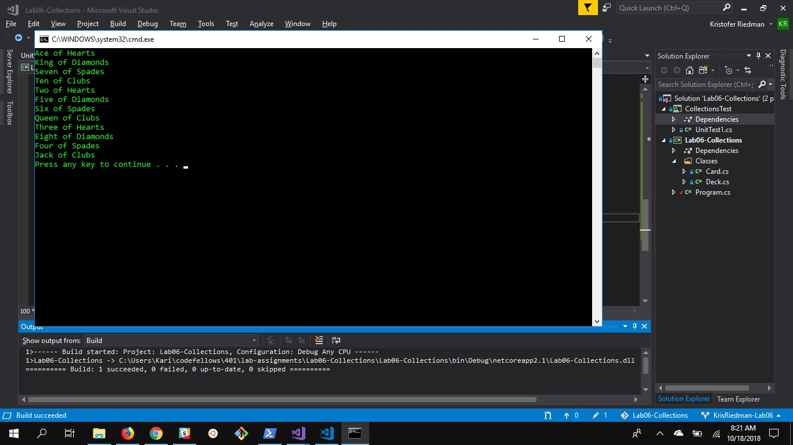
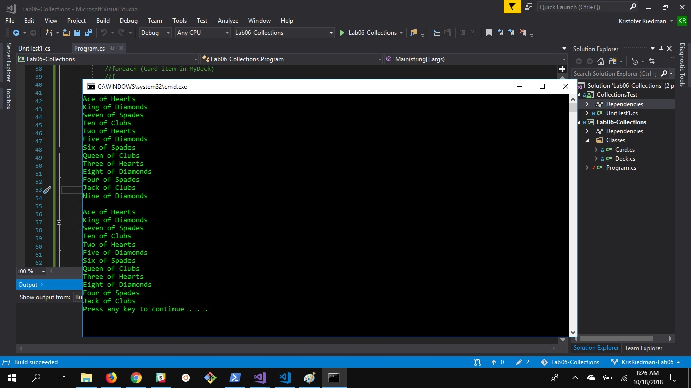
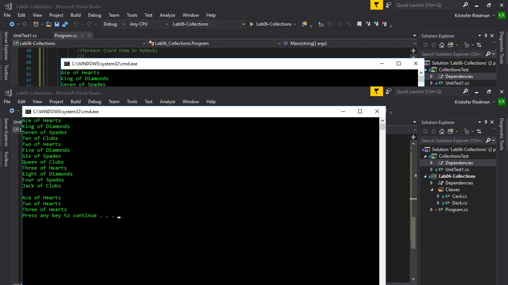

# Lab06-Collections
## Description
This is a deck and card app.  Users can create cards with a suite and a value, add them to a deck, remove them from a deck, and see all cards of one suit.

## Instructions
1. Open Visual Studio
2. Open Solution File
3. Create a Deck, Create Cards, use the Add method to add them, use the Remove method to remove them, and use the ShowSuit method to see all cards of one suit.

## Visual

